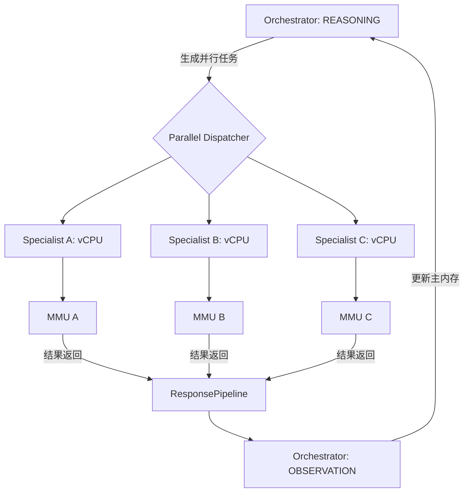

# Orchestrator 并行调度 Specialist Agents 设计文档

## 1. 概述
在 Nimbus 框架中，Orchestrator 负责将复杂任务拆解并分发给多个 Specialist Agents（如 Explorer, Implementer, Architect, Tester）。为了提高执行效率，框架支持 Specialist Agents 的并行调度。本文档详细描述了其并发模型、状态隔离机制以及结果聚合流程。

## 2. 并行触发机制

### 2.1 任务发现与规划
Orchestrator 在 `REASONING` 阶段通过 ALU（LLM）分析当前目标。如果 LLM 识别出多个互不依赖的子任务，它会生成一组并发指令。

### 2.2 触发逻辑
并行触发主要通过 `vcpu.py` 中的 `step()` 循环与 `ResponsePipeline` 协作完成：
- **Tool Call 映射**：当 LLM 输出包含多个 `call_agent` 的工具调用时，Orchestrator 不再顺序执行。
- **异步调度**：系统利用 Python 的 `asyncio.gather` 或任务队列并行启动多个子 Agent 的 vCPU 实例。
- **非阻塞 IO**：每个 Specialist Agent 拥有独立的 `FSMContext`，确保在等待模型响应时不会阻塞其他 Agent。

## 3. 状态隔离机制

为了防止并发执行时的上下文污染，Nimbus 采用了多层隔离设计：

### 3.1 内存隔离 (MMU Isolation)
每个 Specialist Agent 在启动时会被分配一个独立的 `MMU` (Memory Management Unit) 实例副本：
- **独立消息队列**：子 Agent 的 `mmu.current_frame.messages` 仅包含与其任务相关的上下文。
- **写时拷贝 (CoW) 模拟**：子 Agent 对其本地内存的修改不会直接反映到 Orchestrator 的主内存中，直到结果被聚合。

### 3.2 运行环境隔离
- **FSM 独立性**：每个 Agent 运行在自己的 `FSMContext` 中，拥有独立的迭代计数器（`iteration_count`）和状态机寄存器。
- **工具权限限制**：Orchestrator 会根据 Agent 角色（Manifest）动态注入工具集。例如，Explorer 仅获得 `Read` 权限，而 Implementer 获得 `Write` 权限。

## 4. 结果聚合流程

当并行任务完成或部分失败时，Orchestrator 执行以下聚合步骤：

### 4.1 数据收集
`ResponsePipeline` 负责监听所有子任务的 `StepResult`。
- **成功处理**：提取 `ToolResult` 中的 `output`。
- **异常捕获**：如果某个 Agent 崩溃，其错误信息将被封装为特殊的 `ToolResult` 传递给聚合逻辑，避免整个流水线挂起。

### 4.2 观察合并 (Observation Merging)
在 Orchestrator 进入 `StateObservation` 阶段时：
1. **内容汇总**：将所有子 Agent 的执行结果按提交顺序拼接。
2. **内存注入**：将汇总后的结果通过 `mmu.add_observation()` 写入 Orchestrator 的主消息队列。
3. **事实更新**：如果子 Agent 产生了重要的 Artifacts（通过 `NimFSWriteArtifact`），其引用 ID 会被记录在主上下文中，供后续步骤引用。

### 4.3 决策循环
Orchestrator 根据聚合后的观察结果，在下一轮 `REASONING` 中决定是继续派生新任务，还是汇总最终答案。

## 5. 流程图示

