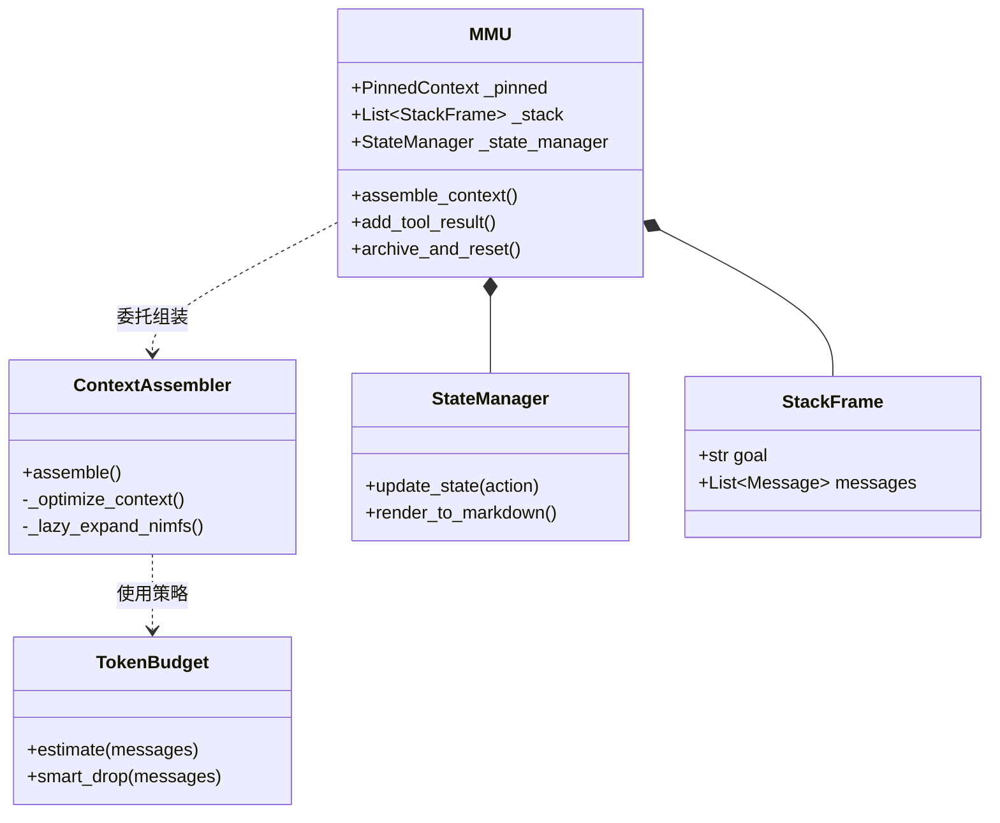
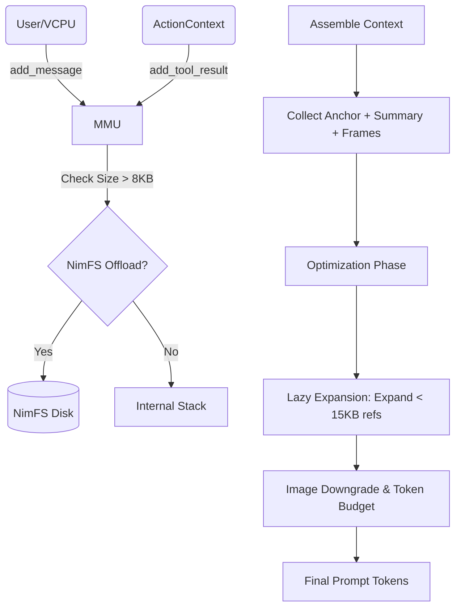

# MMU (Memory Management Unit) 模块架构分析

## 1. 概述与设计理念

MMU 是 Nimbus 智能体内核的核心组件，负责管理长短期记忆、上下文组装以及 Token 预算控制。其设计深受计算机体系结构中虚拟内存管理和分级缓存理念的启发。

### 核心理念
- **Anchor-Stream 分层模型**：将上下文分为静态锚点（Pinned Context）和动态流（Message Stream），实现长期目标与短期操作的解耦。
- **确定性追踪**：通过 `StateManager` 实时追踪外部环境（如文件系统、执行结果）的变更，确保模型始终感知最新的“世界状态”。
- **弹性扩展与 Offload**：利用 NimFS 提供无限的存储后端，当单次工具输出过大或上下文溢出时，自动触发 Offload 与延迟展开（Lazy Expansion）。
- **智能降级（Smart Drop）**：基于信息价值而非单纯的时间顺序进行上下文修剪，优先保留关键决策和热点信息。

---

## 2. 目录结构与文件清单

MMU 模块位于 `src/nimbus/core/memory/`，采用职责分离的设计：

| 文件 | 核心职责 |
| :--- | :--- |
| `__init__.py` | 模块入口，定义公共 API 接口。 |
| `mmu.py` | 核心控制逻辑，负责内存状态维护、栈帧管理及归档操作。 |
| `context.py` | 定义基础数据模型（Message, PinnedContext, StackFrame）。 |
| `context_assembler.py` | 负责复杂的上下文组装流程，包含 Token 优化和 NimFS 展开。 |
| `token_budget.py` | 封装 Token 估算算法与 Smart Drop 丢弃策略。 |
| `state_manager.py` | 环境状态追踪，维护文件工作集及执行反馈。 |

---

## 3. 核心类与数据模型详解

### 3.1 类关系图 (Mermaid)

### 3.2 关键数据模型
- **Message**: 封装对话项，支持 `nimfs_ref` 属性用于大文本引用。
- **PinnedContext (Anchor)**: 存放系统提示词、全局目标及项目关键实体 L0 摘要。
- **StackFrame**: 支持递归任务分解，每一帧代表一个子任务作用域。

---

## 4. 内存布局（Anchor & Stream）

MMU 将内存组织为两个主要部分：

1.  **Anchor (锚点区)**
    - **Pinned Context**: 长期不变的上下文，如 Role 定义、全局任务、NimFS LoadContext 加载的知识。
    - **Global Summary**: 对已归档历史的滚动总结，保持长期记忆的连续性。
    - **Environment State**: 由 `StateManager` 渲染的 Markdown，包含当前修改的文件列表、测试结果等。

2.  **Stream (消息流区)**
    - **Stack Frames**: 按照调用栈组织的对话历史。
    - **Viewport**: 当前活跃的窗口，受 Token 预算严格限制。

---

## 5. 关键流程分析

### 5.1 数据流图 (Mermaid)

### 5.2 核心算法说明
- **NimFS Auto-offload**: 当 `tool_result` 超过 8000 字符时，MMU 会自动将其写入 NimFS 并替换为引用标签，极大地减缓了 Token 的消耗速度。
- **Lazy Expansion (延迟展开)**: 在组装上下文时，若引用的 NimFS 内容较小（≤15KB）或者是当前“热点”消息，则自动回填内容。
- **Archive & Reset (内存压缩)**: 当 Context 达到 90% 阈值时，自动寻找非 Tool-use 中断点进行截断，并将被截断部分总结进 `global_summary`。

---

## 6. 状态管理与确定性追踪

`StateManager` 是 MMU 的眼睛，它通过以下机制增强智能体的感知：
- **工具监控**: 自动识别 `Write`、`Edit`、`Bash` 等操作。
- **文件工作集**: 维护一个当前任务涉及的文件列表（Created/Modified/Read），并在上下文组装时注入。
- **启发式反馈**: 自动解析 shell 输出中的错误信息（如 pytest failures），并将其高亮标记为失败状态。

---

## 7. 对外接口与依赖关系图

MMU 处于内核的中心位置：

- **VCPU**: 驱动者。调用 `assemble_context` 获取模型输入。
- **ActionContext**: 生产者。在工具执行完成后，通过 `add_tool_result` 喂入数据。
- **CompactionService**: 维护者。后台异步调用 `archive_and_reset` 进行剪枝。
- **CheckpointManager**: 持久化。获取 MMU 状态快照实现恢复。

---

## 8. 配置参数参考 (MMUConfig)

| 参数名 | 默认值 | 说明 |
| :--- | :--- | :--- |
| `max_context_tokens` | 180,000 | 总上下文窗口限制。 |
| `pinned_budget` | 10,000 | 锚点区预留 Token。 |
| `compress_threshold` | 0.9 | 触发自动归档的比例阈值。 |
| `nimfs_offload_threshold`| 8,000 | 触发自动 Offload 的字符长度。 |
| `keep_recent_messages` | 20 | 压缩时强制保留的最近消息数。 |

---

## 9. 设计模式总结

1.  **代理模式 (Proxy Pattern)**: `MMU` 内部将组装逻辑代理给 `ContextAssembler`。
2.  **状态模式 (State Pattern)**: 通过 `StateManager` 管理不同阶段的环境反馈。
3.  **策略模式 (Strategy Pattern)**: `Smart Drop` 实现了不同的 Token 回收策略。
4.  **备忘录模式 (Memento Pattern)**: 与 `CheckpointManager` 配合实现状态的快照与恢复。
