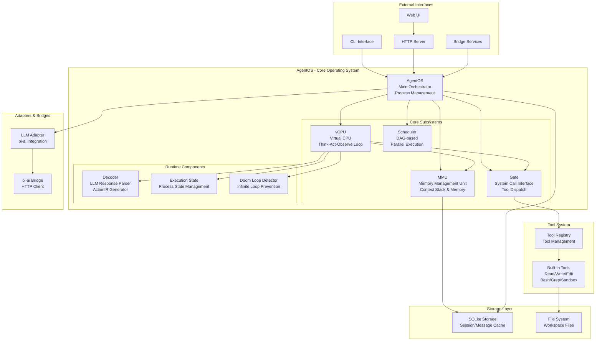
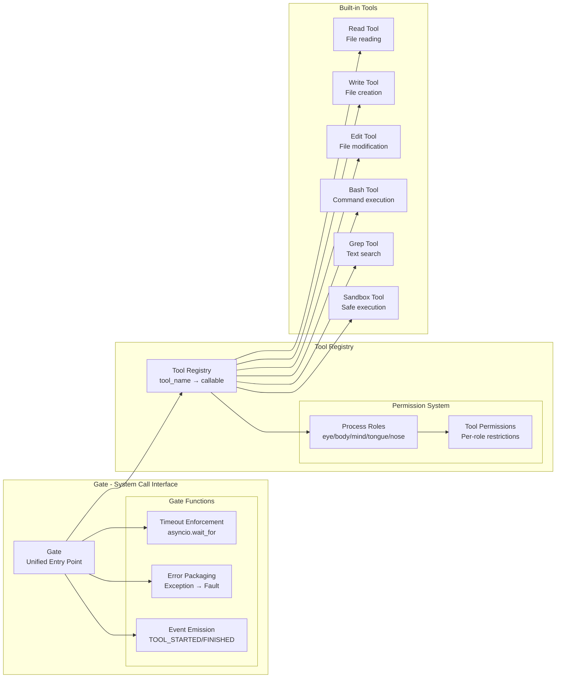
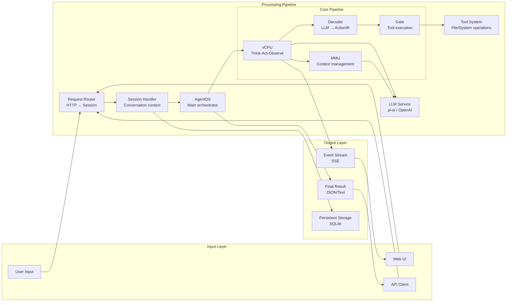

# Nimbus Agent Framework 架构图

## 整体架构



## vCPU 执行流程

```mermaid
sequenceDiagram
    participant U as User
    participant OS as AgentOS
    participant CPU as vCPU
    participant MMU as MMU
    participant DEC as Decoder
    participant GATE as Gate
    participant TOOLS as Tools

    U->>OS: run("goal")
    OS->>CPU: execute(goal)
    
    loop Think-Act-Observe Loop
        CPU->>MMU: get_context()
        MMU-->>CPU: context_messages
        
        CPU->>CPU: Think (LLM)
        CPU->>DEC: decode(llm_response)
        DEC-->>CPU: ActionIR[]
        
        loop Execute Actions
            CPU->>GATE: execute_tool(action)
            GATE->>TOOLS: call tool
            TOOLS-->>GATE: result
            GATE-->>CPU: ToolResult
            CPU->>MMU: add_message(result)
        end
        
        CPU->>CPU: Observe & Decide
        
        alt Goal Complete
            CPU->>MMU: add_message(final_result)
            break
        else Continue
            note over CPU: Next iteration
        end
    end
    
    CPU-->>OS: ExecutionResult
    OS-->>U: final_result
```

## 内存管理架构 (MMU)

```mermaid
graph TB
    subgraph "MMU - Memory Management Unit"
        subgraph "Memory Layout"
            PINNED[Pinned Context<br/>- System Rules<br/>- Workspace Info<br/>- Capabilities<br/><br/>🔒 Never Compressed]
            
            subgraph "Context Stack"
                ROOT[Root Frame<br/>Main Conversation<br/>messages[...]]
                SUB1[Sub Frame 1<br/>goal: 'explore codebase'<br/>messages[...]]
                SUB2[Sub Frame 2<br/>goal: 'find auth module'<br/>messages[...]]
            end
        end
        
        subgraph "Memory Operations"
            PUSH[push_frame()<br/>Create new sub-context]
            POP[pop_frame()<br/>Extract valuable content<br/>Filter failed explorations]
            COMPRESS[auto_compress()<br/>Token budget management]
            ASSEMBLE[assemble_context()<br/>Bottom-up assembly]
        end
        
        subgraph "Context Refinement"
            FILTER[Filter Failed Tools<br/>Remove unsuccessful attempts]
            EXTRACT[Extract Conclusions<br/>Keep valuable insights]
            MERGE[Merge to Parent<br/>Integrate useful findings]
        end
    end
    
    PINNED --> ASSEMBLE
    ROOT --> ASSEMBLE
    SUB1 --> ASSEMBLE
    SUB2 --> ASSEMBLE
    
    PUSH --> SUB2
    POP --> FILTER
    FILTER --> EXTRACT
    EXTRACT --> MERGE
    MERGE --> ROOT
    
    ASSEMBLE --> COMPRESS
```

## 工具系统架构



## 会话管理架构

```mermaid
graph TB
    subgraph "Server Layer"
        HTTP[FastAPI Server<br/>Port 4096]
        
        subgraph "API Endpoints"
            HEALTH[/api/v1/health]
            SESSIONS[/api/v1/sessions]
            CHAT[/api/v1/sessions/{id}/chat]
            OPENCODE[/session/* - OpenCode Compat]
            AI_SDK[/v1/chat/completions - AI SDK v6]
        end
        
        subgraph "Server Components"
            SSE[SSE Hub<br/>Server-Sent Events]
            CACHE[Message Cache<br/>In-memory storage]
            PERM[Permission Manager<br/>Access control]
        end
    end
    
    subgraph "Session Management"
        SESSION_MGR[Session Manager<br/>Session lifecycle]
        
        subgraph "Session Components"
            SESSION[Session Objects<br/>conversation_id, metadata]
            AGENT_POOL[Agent Process Pool<br/>Multiple AgentOS instances]
        end
    end
    
    subgraph "Storage Layer"
        SQLITE[SQLite Storage<br/>.nimbus/nimbus.db]
        
        subgraph "Data Tables"
            SESS_TABLE[sessions table]
            MSG_TABLE[messages table] 
            META_TABLE[metadata table]
        end
    end
    
    HTTP --> HEALTH
    HTTP --> SESSIONS
    HTTP --> CHAT
    HTTP --> OPENCODE
    HTTP --> AI_SDK
    
    HTTP --> SSE
    HTTP --> CACHE
    HTTP --> PERM
    
    SESSIONS --> SESSION_MGR
    CHAT --> SESSION_MGR
    SESSION_MGR --> SESSION
    SESSION_MGR --> AGENT_POOL
    
    SESSION_MGR --> SQLITE
    SQLITE --> SESS_TABLE
    SQLITE --> MSG_TABLE
    SQLITE --> META_TABLE
    
    SSE --> CACHE
```

## 数据流架构



## 关键组件说明

### 1. AgentOS (agentos.py)
- **作用**: 系统的主要协调者，类似操作系统内核
- **功能**: 进程管理、组件编排、工具注册、事件聚合
- **代码行数**: ~1220行

### 2. vCPU (core/runtime/vcpu.py)  
- **作用**: 虚拟CPU，执行思考-行动-观察循环
- **功能**: LLM调用、指令解码、工具执行、状态管理
- **代码行数**: ~1540行

### 3. MMU (core/memory/mmu.py)
- **作用**: 内存管理单元，管理上下文栈
- **功能**: 上下文组装、内存压缩、栈管理、内容提炼
- **代码行数**: ~910行

### 4. Gate (os/gate.py)
- **作用**: 系统调用接口，统一工具执行入口
- **功能**: 超时控制、错误封装、事件发布、权限检查
- **代码行数**: ~409行

### 5. Scheduler (core/scheduler.py)
- **作用**: DAG任务调度器，支持并行执行
- **功能**: 任务依赖管理、并行调度、结果聚合
- **代码行数**: ~963行

### 6. Decoder (core/runtime/decoder.py)
- **作用**: 指令解码器，将LLM响应转换为ActionIR
- **功能**: 结构化解析、多格式支持、错误恢复
- **代码行数**: ~202行

## 设计特点

1. **类OS架构**: 借鉴von Neumann架构，将Agent执行视为操作系统
2. **模块化设计**: 各组件职责清晰，松耦合设计
3. **内存管理**: 智能上下文管理，自动压缩和提炼
4. **并行调度**: DAG-based任务调度，支持复杂工作流
5. **权限隔离**: 基于角色的工具权限管理
6. **事件驱动**: 完整的事件系统，支持实时监控